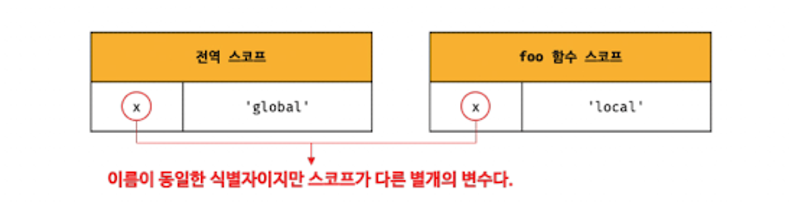
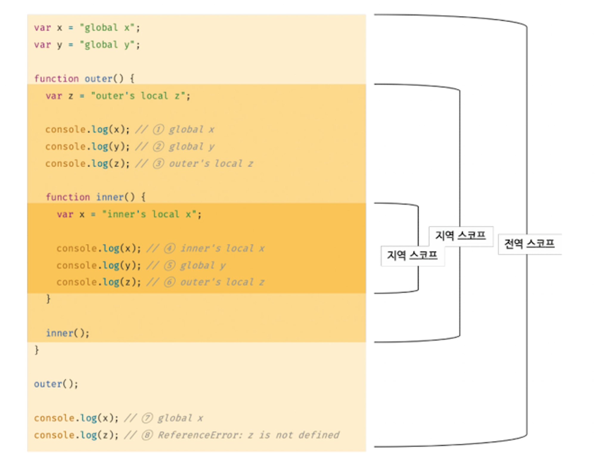
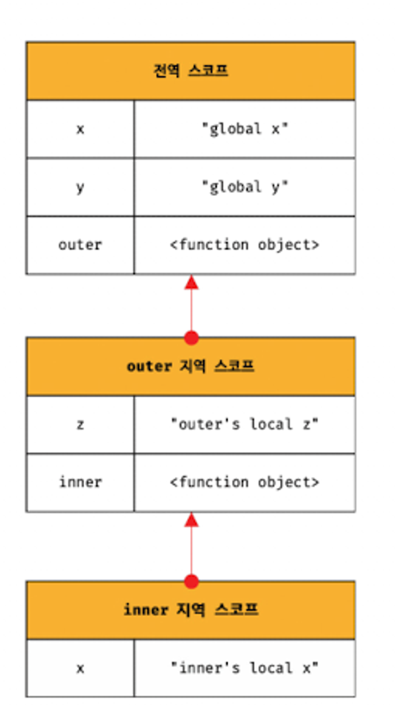

# 13. 스코프

💘 **I N D E X**
- [13-1. 스코프란?](#13-1-스코프란)
    - [선언 키워드에 따른 스코프](#선언-키워드에-따른-스코프)
    - [식별자 결정](#식별자-결정)
    - [스코프 내의 중복 선언을 처리하는 방식 - var와 let](#스코프-내의-중복-선언을-처리하는-방식---var와-let)
- [13-2. 스코프의 종류](#13-2-스코프의-종류)
    - [13-2-1 전역과 전역 스코프](#13-2-1-전역과-전역-스코프)
    - [13-2-2 지역과 지역 스코프](#13-2-2-지역과-지역-스코프)
- [13-3 스코프 체인](#13-3-스코프-체인)
    - [13-3-1 스코프 체인에 의한 변수 검색](#13-3-1-스코프-체인에-의한-변수-검색)
    - [13-3-2 스코프 체인에 의한 함수 검색](#13-3-2-스코프-체인에-의한-함수-검색)
    - [추가) 클로저](#추가-클로저)
- [13-4 함수 레벨 스코프](#13-4-함수-레벨-스코프)
    - [추가) 함수 스코프의 호이스팅](#추가-함수-스코프의-호이스팅)
    - [추가) 블록 스코프](#추가-블록-스코프)
- [13-5. 렉시컬 스코프 (정적 스코프)](#13-5-렉시컬-스코프-정적-스코프)
    - [정적 스코프와 동적 스코프](#정적-스코프와-동적-스코프)
    - [변수 숨기기 -중첩스코프](#변수-숨기기--중첩스코프)

---

## 13-1. 스코프란?

- 스코프는 식별자 언제 어디서 **정의**되는지에 따라 결정한다.
- 변수는 자신이 선언된 위치에 의해 자신이 유효한 범위, 즉 다른 코드가 변수 자신을 참조할 수 있는 범위가 결정된다. 이는 변수를 포함한 모든 식별자에 해당된다.
- 모든 식별자(변수 이름, 함수이름, 클래스 이름 등)는 자신이 선언된 위치에 의해 다른 코드가 식별자 자신을 참조할 수 있는 유효 범위가 결정된다.
- 즉, 스코프는 식별자가 유효한 범위를 말한다.
- **유효한 참조범위** 라고 하면 정리가 될 것 같다.

 <br><br>  

### 선언 키워드에 따른 스코프

- **var : 함수 레벨 스코프(function-level scope)**
    - 함수 내에서 선언된 변수는 함수 내에서만 유효하다.
    - 함수 내의 블록과 상관없음.
    - 함수 외부에서는 참조할 수 없음.
- **let, const : 블록 레벨 스코프(block-level scope)**
    - if문, for문, while문, try/catch문, 함수 내부의 블록 등, 블록 내부에서 선언된 변수는 코드 블록 내에서만 유효하다.
    - 코드 블록 외부에서는 참조할 수 없다.

- 예시1)
    
    ```jsx
    function f(x){
    	//var x;
        console.log(x + 3);
    }
    
    f(5) //8
    x; //ReferenceError: x is not defined
    ```
    
    - 여기에서 x는 함수 내부에만 존재한다.
    - x의 스코프는 함수라고 말할 수 있다.
    - x는 함수 내부에서 하나의 변수처럼 사용이 된다.
    - f(5)는 함수 내부에서 var x=5로 동작한다.
- 예시2)
    
    ```jsx
    
    function add(x, y) {
    //var x, y;
      // 매개변수는 함수 몸체 내부에서만 참조할 수 있다.
      // 즉, 매개변수의 스코프(유효범위)는 함수 몸체 내부다.
      console.log(x, y); // 2 5
      return x + y;
    }
    
    add(2, 5);
    
    // 매개변수는 함수 몸체 내부에서만 참조할 수 있다.
    console.log(x, y); // ReferenceError: x is not defined
    ```
    

- 예시 3)
    
    ```jsx
    var var1 = 1; // 코드의 가장 바깥 영역에서 선언한 변수
    
    if (true) {
      var var2 = 2; // 코드 블록 내에서 선언한 변수
      if (true) {
        var var3 = 3; // 중첩된 코드 블록 내에서 선언한 변수
      }
    }
    
    function foo() {
      var var4 = 4; // 함수 내에서 선언한 변수
    
    	**///만약 이곳에서 var5를 참조한다면?
    	console.log('outside var5 : ',var5);**
    
      function bar() {
        var var5 = 5; // 중첩된 함수 내에서 선언한 변수
      }
    }
    
    console.log(var1); // 1
    console.log(var2); // 2
    console.log(var3); // 3
    console.log(var4); // ReferenceError: var4 is not defined
    console.log(var5); // ReferenceError: var5 is not defined
    
    foo(); //ReferenceError: var5 is not defined
    ```
    
    - var는 함수 스코프이다.
    - var 1,2,3은 전역 변수가 된다.
    - var 4는 함수 내부에서 선언된 변수이므로(스코프가 함수 foo로 한정됨) 외부에서 참조할 수 없어 에러가 난다.
    - var5 또한 함수 내부의 변수이므로 외부에서 참조가 불가능하다.
    - 만약 bar함수 외부이면서 foo함수 내부인 범위에서 var5를 참조한다면 에러가 날 것이다.
    - var5는 bar함수의 스코프이기 때문이다.

<br><br>

### 식별자 결정

- 코드안에 같은 이름을 가진 변수가 각각 다른 스코프 안에 존재할 때, 자바스크립트 엔진은 스코프를 통해 어떤 변수를 참조할 것인지 결정한다.
    
    ```jsx
    var x = 'global';
    
    function foo() {
      var x = 'local';
      console.log(x); // ①
    }
    
    foo();
    
    console.log(x); // ②
    ```
    
    - 위의 예제에서 외부에 선언된 x와, 함수 내부에 선언된 x는 스코프가 서로 다르다.
    - 1번은 전역변수로 어디에서든 참조할 수 있고
    - 2번은 함수 내부에서만 참조할 수 있다.
    
    <br><center></center><br>    
    
- 자바스크립트 엔진은 코드를 실행할 때 문맥을 고려한다(context)
- 코드가 어디에서 실행되고 주변에 어떤 코드가 있는지에 따라 위의 예제처럼 각각의 x에 대해 다른 결과를 만들어낸다.
- **코드가 어디에서 실행되고 주변에 어떤 코드가 있는지** ⇒ 렉시컬 환경
- 즉, 코드의 문맥은 렉시컬 환경으로 만들어진다.
- 이를 구현한 것이 실행 컨텍스트이다.
- 모든 코드는 실행 컨텍스트에서 평가되고 실행된다.
- 자세한 사항은 23장에서 계속된다.

- 코드내에 같은 이름을 가진 식별자가 여럿 존재할 수 있지만,
- 한 스코프 내에서의 식별자는 유일해야한다.
- 즉, 스코프는 네임스페이스라고 할 수 있다.

<br><br>  

### 스코프 내의 중복 선언을 처리하는 방식 - var와 let

- var키워드로 선언된 변수는 같은 스코프 내에서 중복 선언이 허용된다.
- 만약 중복으로 선언되면, 기존의 변수에 재할당이 된다.

```jsx
function foo() {
var x;
var x= undefined;
x=1;
x=2;

  var x = 1;
  // var 키워드로 선언된 변수는 같은 스코프 내에서 중복 선언을 허용한다.
  // 아래 변수 선언문은 자바스크립트 엔진에 의해 var 키워드가 없는 것처럼 동작한다.
  var x = 2;
  console.log(x); // 2
}
foo();
```

- 하지만 let이라 const로 선언된 변수는 같은 스코프 내에서 중복 선언을 허용하지 않는다,

```jsx
function bar() {
  let x = 1;
  // let이나 const 키워드로 선언된 변수는 같은 스코프 내에서 중복 선언을 허용하지 않는다.
  let x = 2; // SyntaxError: Identifier 'x' has already been declared
}
bar();
```

<br><br>  


## 13-2. 스코프의 종류

- 스코프는 전역과 지역으로 구분할 수 있다.
    
    
    | 구분 | 설명 | 스코프 | 변수 |
    | --- | --- | --- | --- |
    | 전역 | 코드의 바깥 영역 |  전역 스코프 | 전역 변수 |
    | 지역 | 함수 몸체 내부 |  지역 스코프 | 지역 변수 |
- 변수는 자신이 선언된 위치에 의해 자신이 유효한 범위가 결정된다.
<br><br>  

### 13-2-1 전역과 전역 스코프

<br><center></center><br>   

- 전역이란 코드의 가장 바깥 영역을 말한다.
- 전역은 전역 스코프를 만든다.
- 전역에 변수를 선언하면 그 변수는 전역 스코프를 갖는다.
- 전역 변수는 어디서든 참조할 수 있다.
- 프로그램을 시작할 때 암시적으로 전체를 아우르는 글로벌 스코프
- 전역 스코프에서 선언된 것들이 전역변수이다.
- 전역스코프에 의존하는 것을 피해야한다. 남용하면 안됨
- 전역 변수를 사용하면 의도치 않게 다른 곳에서 변수에 영향을 줄 수 있기 때문이다.
- 전역 변수를 쓰려면 차라리 단일 객체에 넣어 사용하는 편이 안전하다.
    - 수많은 객체에 일일이 변수를 담는 것을 비효율 적이다.
- 함수의 매개변수를 이용해 함수 스코프를 사용하는 방법도 있다.
<br><br>  

### 13-2-2 지역과 지역 스코프

- 지역이란 함수 몸체 내부 영역이다.
- 지역은 지역 스코프를 만든다.
- 지역에 변수를 선언하면 그 변수는 지역 스코프를 갖는 지역 변수가 된다.
- 지역 변수는 자신이 선언된 지역과 그 하위 지역(중첩 함수)에서만 참조할 수 있다.
- 즉, 지역 변수는 자신의 지역 스코프와 하위 지역 스코프에서만 유효하다.

<br><br>

## 13-3 스코프 체인

- 함수는 중첩될 수 있으므로, 함수의 지역 스코프도 중첩될 수 있다.
- 이는 스코프가 함수의 중첩에 의해 계층적 구조를 갖는다는 것을 의미한다.
- 중첩 함수의 지역 스코프는 중첩 함수를 포함하는 외부 함수의 지역 스코프와 계층적 구조를 갖는 것이다.
- 이때, 외부 함수의 지역 스코프를 중첩 함수의 상위 스코프라고 한다.

<br><center></center><br>  

- 모든 스코프는 하나의 계층적 구조로 연결되며, 모든 지역 스코프의 최상위 스코프는 전역 스코프이다.
- 이렇게 스코프가 계층적으로 연결된 것을 스코프 체인이라고 한다.

<br><br>  

### 13-3-1 스코프 체인에 의한 변수 검색

- 변수를 참조할 때 자바스크립트 엔진은 스코프 체인을 통해 변수를 참조하는 코드의 스코프에서 시작하여 상위 스코프 방향으로 이동하며 선언된 변수를 검색한다.
- 이를 통해 상위 스코프에서 선언한 변수를 하위 스코프에서도 참조할 수 있는 것이다.
- 최상위 글로벌 스코프에 도달하면, 변수를 찾지 못했어도 검색을 멈춘다.

- 스코프 체인은 물리적인 실체로 존재한다.
- 자바스크립트 엔진은 위 그림과 유사한 자료구조인 렉시컬 환경을 실제로 생성한다.
- 변수 선언이 실행되면 식별자를 키값으로 저장하고, 변수 할당이 일어나면 해당 키의 값으로 저장한다.
- 상위 스코프에서 유효한 변수는 하위 스코프에서는 참조할 수 있지만, 하위 스코프에서 유효한 변수를 상위 스코프에서 참조할 수 없다.

<br><br>

### 13-3-2 스코프 체인에 의한 함수 검색

```jsx
// 전역 함수
function foo() {
  console.log('global function foo');
}

function bar() {
  // 중첩 함수
  function foo() {
    console.log('local function foo');
  }

  foo(); // ① 내부의 foo함수를 가리킨다.
}

bar();//① - 'local function foo'
```

- 선언문으로 함수를 정의하면 런타임 이전에 함수 객체가 먼저 생성된다.(호이스팅)
- 자바스크립트 엔진은 함수 이름과 동일한 이름의 식별자를 암묵적으로 선언하고 함수 객체를 할당한다.
- 1번의 foo함수를 호출하면, 자바스크립트 엔진은 함수를 호출하기 위해 먼저 함수를 가리키는 식별자 foo를 검색한다.
- 본인이 속한 스코프부터 검색하므로 내부의 foo함수를 찾아 실행한다.
- 이처럼 함수도 식별자이기 때문에 함수 자체도 본인의 스코프를 갖는다.

<br><br>

### 추가) 클로저

> 💡 다른 책에서 스코프 체인을 클로저로 설명하고 있어서 내용을 가져왔습니다.<br>
사실 클로저에 대해 설명하려면 더 자세한 내용이 있어야하지만 나중에 다른 챕터에서 다루므로 여기에서는 스코프 체인의 개념으로 이 섹션을 이해해주시면 되겠습니다.

<br>

- **클로저**
    - 함수가 특정 스코프에 접근할 수 있도록 의도적으로 그 외부의 스코프에서 정의함.
    - 코어 자바스크립트에서는 함수의 내부 환경과,
    - 외부 스코프 환경 중에 함수가 참조하는 것을 합쳐서 스코프라고 한다.
    - 즉, 함수가 실행되기에 필요한 것들만 스코프로 만들어놓은 것이 클로저이다.
    
    ```jsx
    let globalFunc; //정의되지 않은 전역 함수
    
    {
        let blockVar = 'a'; //블록스코프 내부 변수
        globalFunc = function(){
            console.log(blockVar)
        }
    }
    
    globalFunc(); //a
    ```
    
    - globalFunc은 정의되어 있지 않다가 블록 내부에서 값이 할당되었다.
    - 이 블록스코프와 그 부모인 전역스코프가 클로저를 형성한다.
    - globalFunc는 외부의 전역 스코프에서 가져오기 때문이다.
    - 전역의 전체가 클로저가 아니고, 전역 스코프 중에 globalFunc 등 내부 스코프(블록스코프)에서 사용하는 변수 환경만을 이야기한다.
    - 클로저가 형성되었기 때문에 globalFunc함수는 클로저에 들어있는 식별자에 접근이 가능하다.
    - 그래서 외부 전역에서 globalFunc을 실행시켜도 blockVar에 접근하여 a를 반환하는 것이다.
    - 코드의 실행이 끝나면 스코프도 끝나고, 스코프가 끝나면 그 안의 변수 또한 gc로 인해 메모리에서 제거된다.
    - 위의 예제에서 블록스코프가 끝났음에도, 아래 구문(마지막줄)의 globalFunc에서 내부의 blockVar를 참조할 것이기에 스코프를 계속 유지해준다.
    - 그래서 globalFunc를 실행해도 blockVar를 반환할 수 있었던 것이다.


<br><br>

## 13-4 함수 레벨 스코프

- 함수 레벨 스코프란 지역 스코프가 코드 블록이 아닌 함수에 의해서만 생성된다는 의미이다.
- 자바스크립트에서는 var키워드로 선언된 변수는 오로지 함수의 코드 블록만을 지역 스코프로 인정하고, 다른 코드 블록(if, for, while....)은 지역 스코프를 만들지 않는다.

```jsx
var x = 1;

if (true) {
  // var 키워드로 선언된 변수는 함수의 코드 블록(함수 몸체)만을 지역 스코프로 인정한다.
  // 함수 밖에서 var 키워드로 선언된 변수는 코드 블록 내에서 선언되었다 할지라도 모두 전역 변수다.
  // 따라서 x는 전역 변수다. 이미 선언된 전역 변수 x가 있으므로 x 변수는 중복 선언된다.
  // 이는 의도치 않게 변수 값이 변경되는 부작용을 발생시킨다.
  var x = 10;
}

console.log(x); // 10
```

```jsx
var i = 10;

// for 문에서 선언한 i는 전역 변수다. 이미 선언된 전역 변수 i가 있으므로 중복 선언된다.
for (var i = 0; i < 5; i++) {
  console.log(i); // 0 1 2 3 4
}

// 의도치 않게 변수의 값이 변경되었다.
console.log(i); // 5 //먼저 i++한 뒤에 i<5조건을 보기때문에 i는 5가 된다.
```

<br><br>

### 추가) 함수 스코프의 호이스팅

- 함수 선언문은 그 자체로 호이스팅이 되지만,
- 변수에 함수를 할당하는 형태인 함수 표현식은 함수가 끌어올려지지 않는다.
    - 변수는 호이스팅할 때, 변수만 위로 끌어올려져 선언한 뒤 초기화가 이루어진다.(undefined가 됨)
    - 그 값인 함수는 해당 라인이 실행되는 시점에서야 변수에 할당된다.
    - 그러므로 함수 표현식은 호이스팅 되지 않는다고 하는 것이다.
    - 정확히는 함수표현식에서 변수는 호이스팅되고, 할당되는 함수는 호이스팅되지 않는다고 해야할 것이다.
- 함수 선언문
    
    ```
    myFunc(); //This is myFunc
    
    function myFunc(){
        console.log('This is myFunc');
    }
    ```
    
- 함수 표현식
    
    ```jsx
    myFunc(); **//TypeError : myFunc is not a function**
    
    var myFunc = function(){
        console.log('This is myFunc');
    }
    ```
    

<br><br>

### 추가) 블록 스코프

- 블록스코프는 해당 블록의 스코프에서만 ‘보이는’ 식별자를 의미한다.
- let과 const는 식별자를 블록 스코프에서 선언한다.

```jsx
console.log('before block');
{
    console.log('inside block');
    const x = 3;
    console.log(x);
}
console.log(`outside block; x = ${x}`); //ReferenceError: x is not defined
```

```jsx
//block1
    const x = 'blue';
    console.log(x);//blue
}

console.log(typeof x);//undefined;

{
    //block2
    console.log(x);//ReferenceError: x is not defined
}
console.log(typeof x);//undefined;
```

<br><br>

## 13-5. 렉시컬 스코프 (정적 스코프)

- 스코프는 어디서 어떻게 식별자를 찾는가를 결정하는 규칙의 집합이다.
- 자바스크립트는 렉시컬 스코프를 따른다. (렉시컬 스코프, 또는 정적 스코프라고 한다.)
- 함수를 어디서 호출했는지가 아니라 함수를 어디서 정의했는지에 따라 상위 스코프를 결정한다.
- 함수가 호출된 위치는 상위 스코프 결정에 어떠한 영향도 주지 않는다.
- 즉, 함수의 상위 스코프는 언제나 자신이 정의된 스코프인 것이다.

```jsx
var x = 1;

function foo() {
  var x = 10;
  bar();
}

function bar() {
  console.log(x);
}

foo(); // 1
bar(); // 1
```

- 자바스크립트는 렉시컬 스코프를 따르므로, 함수를 어디에서 정의했는지에 따라 상위 스코프를 결정한다.
- 함수가 호출된 위치는 상위 스코프를 결정하는 것에 어떠한 영향도 주지 않는다.
- 즉, 함수의 상위 스코프는 언제나 자신이 정의된 스코프이다.
- 위의 예제에서 bar함수는 전역에서 정의된 함수이다.
- 그러므로 **bar의 상위 스코프는 전역 스코프**이며, bar함수 내부에서 참조하는 x는 전역변수 x이다.

<br><br>

### 정적 스코프와 동적 스코프

- **동적 스코프** : 함수를 어디에서 **호출**했는지에 따라 함수의 상위 스코프를 결정한다.
- **정적 스코프** : 함수를 어디서 **정의**했는지에 따라 함수의 상위 스코프를 결정한다.

- **예제 - 보이는 가시성과 존재의 차이**
    
    ```jsx
    const x = 3;
    
    function f(){
        console.log(x); //3
        console.log(y); //ReferenceError: y is not defined
    }
    
    //새 스코프
    {
        const y = 5;
        f();
    }
    ```
    
    - 변수 x는 함수 f를 정의할 때 존재하지만, y는 그렇지 않다.
    - x는 위의 예제에서 글로벌이다.
    - 만약 f안에서 x를 선언했다면 함수 내부 스코프 안에 새로운 x를 선언하는 것이다.
    - 일단 함수 내부에서 x를 찾는다.
    - 함수 안에 x를 선언하지 않았으므로,(변수 x가 존재하지 않으므로) 함수 밖에서 x를 찾는다.
    - 밖에서 const  x = 3을 찾았다.
    - 함수를 정의할 때 이미 x를 외부에서 찾아 가리키고 있다.
        - 호출할 때가 아닌, 정의할 때 스코프를 알 수 있으므로 정적 스코프이다.
    - x는 존재하지만 함수 스코프 안에는 없는 변수인 것이다.
    - 그러니 존재와 스코프는 구별해서 봐야한다.
    
    - y는 다른 블록 스코프 안에 존재한다.
    - 다른 스코프에서 y를 선언하고 그 안에서 함수 f를 호출하더라도,
    - x는 함수의 스코프 안에 있지만, y는 여전히 레퍼런스 에러를 띄운다.
    - 만약 실행할 때 스코프가 형성된다면 y또한 함수 내부에서 찾을 수 있다.
    - 하지만 자바스크립트는 정적 스코프이므로, 함수가 선언될 당시에 접근가능한 식별자들로 스코프가 생성된다.
        - 그래서 함수 내부에서 x는 존재하고, y는 존재하지 않는 것임.
    - 정리하자면, **함수 f는 자신이 정의될 때 접근할 수 있었던 식별자에는 접근할 수 있지만, 호출할 때 스코프에 있던 식별자에는 접근할 수 없다. (이미 선언 당시에 스코프가 형성되기 때문)**
    

- 자바스크립트의 정적 스코프는 아래에 적용된다.
    - 전역 스코프 (global scope)
    - 블록 스코프 (block scope)
    - 함수 스코프 (function scope)

<br><br>

### 변수 숨기기 -중첩스코프

```jsx
const x = 'this is global x';
const z = 'zzzz';
{
  //외부 블록
  const x = 'blue';
  const y = 'red';

  console.log(x); //blue
  console.log(y); //red
  console.log(z); //zzz

  {
      //내부 블록;
      let x = 3;
      console.log(x); //3
      console.log(y); //red
      console.log(z); //zzz
  }
  console.log(x); //blue
}

console.log(typeof y);//undefined;
```

- 위의 예제는 변수 숨김(variable masking)을 잘 보여준다.
- 내부 블록의 x는 외부 블록에서 정의한 x와 이름만 같을 뿐 다른 변수이다.
- 내부 블록 안에서는 외부 블록(외부스코프)의 x를 가리는(숨기는)효과가 있다.
- 중요한 것은, 실행 흐름이 내부 블록에 들어가 새 변수 x를 정의하는 순간, 두 변수가 모두 스코프 안에 있다는 것이다.
- 다만, 변수의 이름이 같으므로 외부 스코프에 있는 변수에 접근할 방법이 없을 뿐이다.